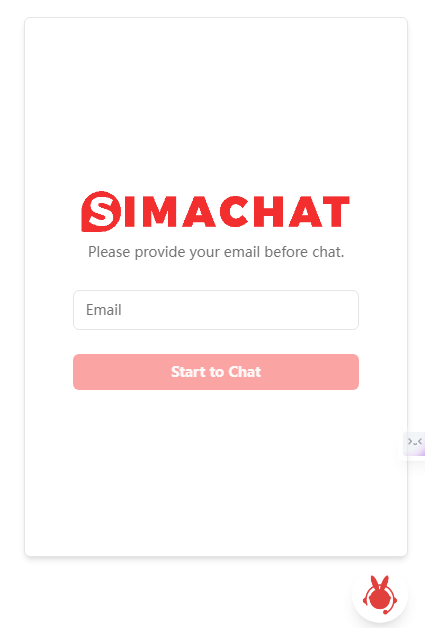

# APIGPT.Cloud - AI问答 开发文档


# 1 AI问答应用
## 1.1 创建应用
登录<a href='https://app.pgpt.cloud/'>企业版</a>管理页面，去到`AI问答`板块，点击`创建AI问答`

<aside class="notice">
如还没有企业版账号，可先注册，并选择使用APIGPT服务
</aside>


填写应用数据后提交


即可在应用列表看到已创建的应用


## 1.2 添加资源、知识
除了在创建应用时需要上传资源文件以供AI问答训练外，已创建的AI问答应用还可以添加资源和知识。

其中资源是以文件的形式导入的，支持的文件格式包括pdf、excel、txt这几种。

知识是通过文本的形式添加，您可以在文本编辑器中输入您的资料。

## 1.3 使用Playground测试问答
在AI问答中上传资料文件后，APIGPT会将您的资料转换成向量数据并自动训练AI，您可以在playground中询问AI与资料内容相关的问题，并查看相关回答。


## 1.4 将AI问答嵌入网站
点击客服图标，即可出现一段代码，将它放入您网站上，即可出现问答图标


点击嵌入的图标，输入邮箱，即可使用AI问答



## 1.5 添加人工支持链接
点击AI问答应用上的`edit`按键，即可弹出知识库编辑页面，其中输入您的人工支持链接，那么在用户使用您的AI问答应用询问“人工支持”等相关问题时，AI便会将您的人工链接返回给用户。


# 2 使用API 
## 2.1 认证
AI问答 使用 API 密钥进行身份验证。请访问你的 <a href='https://app.pgpt.cloud/#/ai_chat'>App 页面</a>，以获取你在请求中使用的 API 密钥。


所有 API 请求都应该在 `Authorization` HTTP 头中包含你的 API 密钥，如下所示：

`Authorization: Bearer <替换成从APIGPT.CLOUD创建的APP Key>`


## 2.2 发送请求
你可以将下面的命令粘贴到终端中以运行你的第一个 API 请求。请确保将 <API-KEY> 替换为你的秘密 API 密钥。

> 发送你的第一个 API 请求

```shell
curl https://aichat.pgpt.cloud/v1/chat/completions \
-H "Content-Type: application/json" \
-H "Authorization: Bearer <API-KEY>" \
-d '{
    "messages": [
        {
            "role": "user",
            "content": "深言答意是什么"
        }
    ],
    "stream": false,
    "model": "gpt-3.5-turbo",
    "temperature": 0.5,
    "presence_penalty": 0,
    "frequency_penalty": 0,
    "max_tokens": 1000
}'
```
```python
import openai
openai.api_key = "<API_KEY>"
openai.api_base = 'https://aichat.pgpt.cloud/v1'
res = openai.ChatCompletion.create(
  model="gpt-3.5-turbo",
  messages=[
    {"role": "system", "content": "You are a helpful assistant."},
    {"role": "user", "content": "Hello!"}
  ]
)
print(res)
```

> 如果你会收到类下面JSON格式的数据响应，这说明你的请求成功了

```json
{
    "id": "chatcmpl-8p5yYyi9TRZ0bWH5yCFn8jdHl2vcu",
    "object": "chat.completion",
    "created": 1707188390,
    "model": "gpt-35-turbo",
    "prompt_filter_results": [
        {
            "prompt_index": 0,
            "content_filter_results": {
                "hate": {
                    "filtered": false,
                    "severity": "safe"
                },
                "self_harm": {
                    "filtered": false,
                    "severity": "safe"
                },
                "sexual": {
                    "filtered": false,
                    "severity": "safe"
                },
                "violence": {
                    "filtered": false,
                    "severity": "safe"
                }
            }
        }
    ],
    "choices": [
        {
            "finish_reason": "stop",
            "index": 0,
            "message": {
                "role": "assistant",
                "content": "\"深言答意\"是一个成语，意思是说话或回答非常深刻和有见地。它形容一个人的言辞或回答非常有智慧和深度，能够揭示问题的本质或提供有价值的观点。"
            },
            "content_filter_results": {
                "hate": {
                    "filtered": false,
                    "severity": "safe"
                },
                "self_harm": {
                    "filtered": false,
                    "severity": "safe"
                },
                "sexual": {
                    "filtered": false,
                    "severity": "safe"
                },
                "violence": {
                    "filtered": false,
                    "severity": "safe"
                }
            }
        }
    ],
    "usage": {
        "prompt_tokens": 39,
        "completion_tokens": 81,
        "total_tokens": 120
    }
}
```

### Request Body

#### 参数 - model `string` Required
要使用的模型ID。目前我们支持并推荐用 `gpt-3.5-turbo`, `gpt-3.5-turbo-16k`, `gpt-4`,`gpt-4-32k`, `gpt-4-turbo`, `gpt-4-tubo-vision`

#### 参数 - messages `array` Required

到目前为止，对话包含的消息列表

消息 `message` 的数据结构:

参数 | 类型 | 是否必须 | 描述
-----|------|----------|-------
role | `string` | `Required` | 消息作者的角色。其中之一是`system`、`user`、`assistant`。
content | `string` | `Optional` | 消息的内容。除了带有函数调用的`assistant`，所有消息都需要 `content`。
name | `string` | `Optional` | 此 `content` 作者的姓名。姓名可以包含a-z、A-Z、0-9和下划线，最长长度为64个字符。


#### 参数 - temperature `number` Optional Defaults to 1

要使用的采样温度，介于0和2之间。较高的值（如0.8）会使输出更加随机，而较低的值（如0.2）会使输出更加集中和确定性。

#### 参数 stream `boolean` Optional Defaults to false

如果设置了此选项，将发送部分消息增量，就像在 ChatGPT 中一样。令牌将作为数据类型的服务器发送的事件逐步发送，一旦可用，流将以 data: [DONE] 消息终止。


#### 参数 max_tokens `integer` Optional Defaults to inf

在聊天补全中生成的最大令牌数。
输入令牌和生成令牌的总长度受模型上下文长度的限制。

